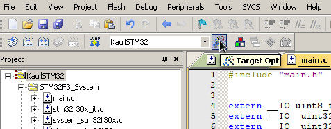
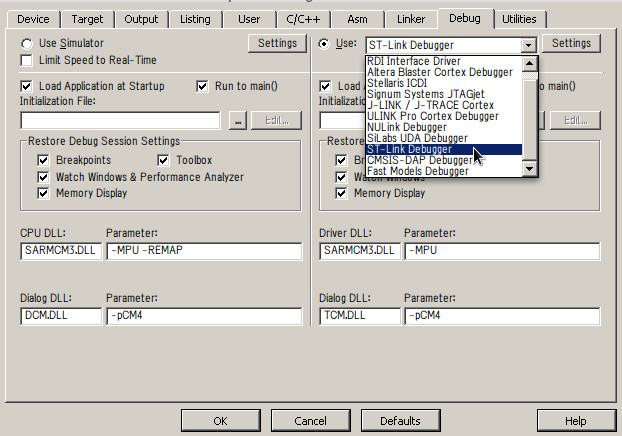
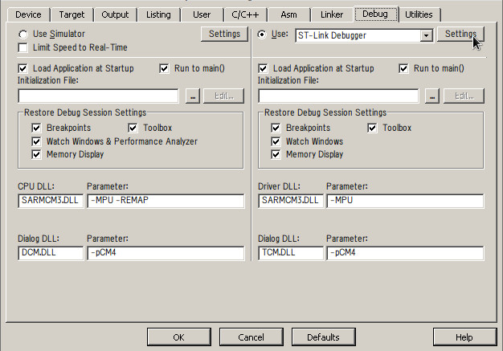
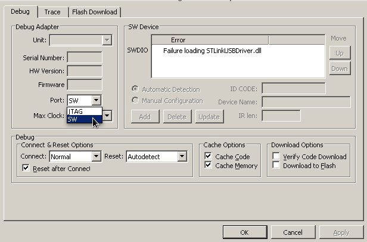
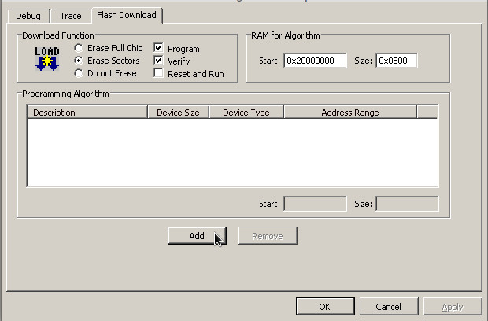
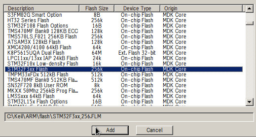
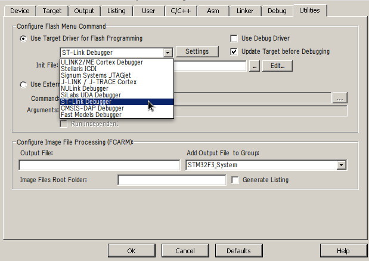

Kauil_STM32
===================

This repository has the code for the V2 controller board of Kauil. It uses an STM32F3 microcontroller to interface the hardware peripherals to the Linux system on board of the robot.

Structure of the repository
--------------------------------
The repository is organized to optimize the collaboration amongst members of the team simultaneously and reduce the amount of conflicts, while also providing a more insightful organization of the code.

A brief description of the main files and folders that are found here is shown below:

 README.md: 
 : This file.

README.img:
: A folder containing all the images from this README.

Source:
: This folder contains all the source code used to build the firmware for the board. Its structure is described in more detail in its own [README][1].

\*Output:
: This folder has all the files generated by the compiler and the linker in order to generate the hex file that will be downloaded to the microcrontroller by the st-link driver.

KauilSTM32Firmware.uvproj:
: This file describes the project in general, is the main one that Keil will open, and is where paths to include files (\*.h) are stored as well as paths to the source files in the project (\*.c).

\*KauilSTM32Firmware.uvopt:
: Here is where Keil stores the configuration of the programmer and the debugger, this file will be generated automatically after configuring the debugger and closing that Keil's session.

**\* Note :** These files and folders were added to the .gitignore file so they are not being version controlled, this was done to keep the repository clean, and they will be generated by Keil automatically.

Other generated files were omitted because they are automatically generated and do not store information relevant to the project like GUI or user preferences.

Setting up a development environment
-----------------------------------------------
This section describes what is the basic configuration that has to be made in to get developing code for the project. Although some familiarity with Keil and the STM32F3 development environment is expected, it's not a requirement.
 
###Windows

- Install MDKARM Keil V4 from [here][2], use all the default configuration settings.
- Install the ST-Link driver that is located in:

        C:\Keil\ARM\STLink\USBDriver\ST-Link_V2_USBDriver.exe

- Connect the USB cable to the port marked with *USB ST-Link*, wait for windows to recognize it and follow any device installation instructions.
- Clone this repository somewhere in your computer, either by using Github's GUI or with the following command on the Git Shell:

        git clone https://github.com/Robots-de-Rescate/Kauil_STM32.git

- Open the file KauilSTM32Firmware.uvproj, Keil should launch automatically and create some files and folders.
- Go to "Target options" in the icon with a magic wand

- In the debug tab select "ST-Link Debugger":

- Click on the Settings button:

- Change the port to SW:

- In the Flash Download tab click the add button:

- Select STM32F3xx Flash and click Add, then click the Ok button:

- Finally on the Utilities tab select the ST-Link Debugger, then click Ok:

Now you should be able to build and download the latest firmware to the STM32, the file KauilSTM32Firmware.uvopt should store the debugging configuration for the next time.

 [1]: https://github.com/Robots-de-Rescate/Kauil_STM32/tree/master/Source
 [2]: https://www.keil.com/demo/eval/armv4.htm hola
