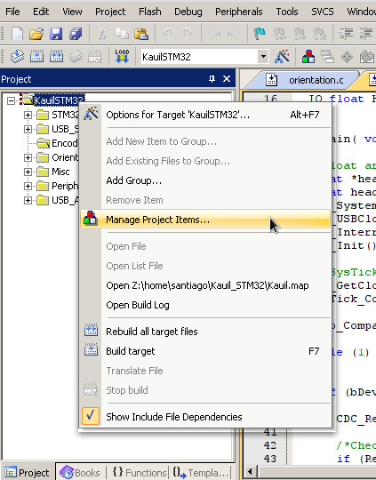
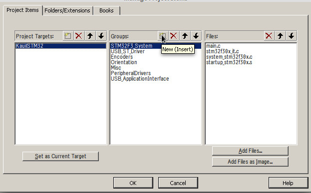
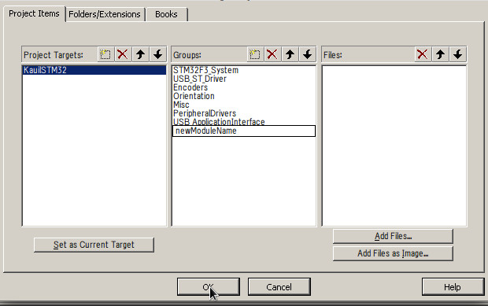
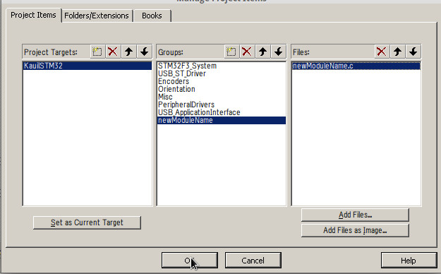
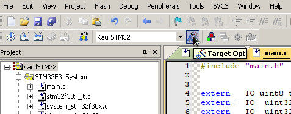
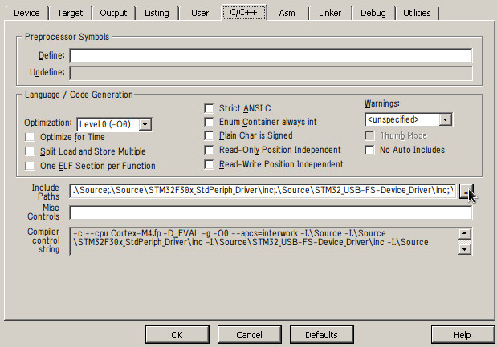
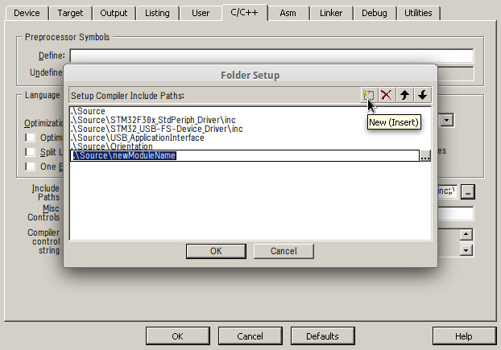

Source code
==========

This folder has all the source code of the firmware, every folder provides a reusable module of code that should provide a specific functionality to the robot.

Files that are not in any folder provide configuration and function definitions common to the whole system like system clock, interrupts and enabled peripherals, these configuration files are provided by the manufacturer; for more information about them please refer to "Description of STM32F30xx/31xx Standard Peripheral Library" ([UM1581][1]) page 28.

Because the idea is to write reusable code, it is expected that any new module will be added like a new folder with a meaningful name and not as spare files.

The folders and files that are found here are described next, if a new module is created, be sure to add its description here too:

<dl>
	<dt>README.md</dt>
	<dd>This file.</dd>
	<dt>README.img</dt>
	<dd>A folder with the images from this README.</dd>
	<dt>main.c/.h</dt>
	<dd>This is the main execution loop, it should contain just a global behavior of the system, any specific functionality should be abstracted as a new module.</dd>
	<dt>STM32F30x_StdPeriph_Driver</dt>
	<dd>Its ST's standard peripheral library which enables higher level functions to interact with the peripherals, the full documentation for it is the "Description of STM32F30xx/31xx Standard Peripheral Library" (<a href="http://www.st.com/st-web-ui/static/active/en/resource/technical/document/user_manual/DM00068049.pdf">UM1581</a>).</dd>
	<dt>STM32_USB-FS-Device_Driver</dt>
	<dd>This is the USB device library, it contains the basic middleware used to use the user USB port from the board. This is the main communication channel between the board and the system on board of the robot. The full documentation about it is "STM32 USB-FS-Device development kit" (<a href="http://www.st.com/st-web-ui/static/active/en/resource/technical/document/user_manual/CD00158241.pdf">UM0424</a>). </dd>
	<dt>USB_ApplicationInterface</dt>
	<dd>This folder has the Application layer required by the USB device library as explained in <a href="http://www.st.com/st-web-ui/static/active/en/resource/technical/document/user_manual/CD00158241.pdf">UM0424</a> page 21, right now it uses the one used in the VirtualComport_Loopback example found in page 53.</dd>
	<dt>Orientation</dt>
	<dd>This module uses libraries provided for the development board to provide an absolute orientation of the robot by using the magnetometer.</dd>
	<dt>Encoders</dt>
	<dd>Reads the quadrature encoders to enable the calculation of the odometry.</dd>
	<dt>Misc</dt>
	<dd>This folder is used to store small snippets of code that are not complete module, adding code here must not be a common practice.</dd>
	<dt>Ros_USB</dt>
	<dd>This directory contains the library that enable the comunication between the microcontroller and ROS. Open Kauil_STM32/Source/Ros_USB/README.md in order to have a more detail description.</dd>
	<dt>Timers</dt>       
 	 <dd>This directory contains the library that enables the configuration of the Timer 3,at the library it is also dfefined a function that calls a specified function (argument #1) in a specified time (argument #2). Open Kauil_STM32/Source/Timers/README.md for a more detail information of the library.</dd>

</dl>

Modules
----------
A module is some piece of code that has a specific functionality to the system, it consists of a folder with all the source files needed for int inside.

The name of the folder should provide a clear, simple an unambiguous description of the functionality of the source code in it. Inside the folder there must be at least 2 source files (one .c and a .h) with the same name as the folder, this include file should be the only one that needs to be added to the main.c file in order to use the this module.

###Adding a new module

The proceadure required to create a new module for the system using Keil is described next:

- Create a folder /Sources with a meaningful name (in this example we will use *newModuleName*).
- Create files named *newModuleName*.c and *newModuleName*.h inside the folder (for the code too compile your *newModuleName*.c must include *newModuleName*.h).
- Right click the target name and click on Manage Project Items:

- Click on the Add new item on the groups column:

- Type the name of the new module:

- Click on the Add files button and select the file *newModuleName*.c that was created before, then click Ok:

- Go to Target preferences:

- Click the button beside Include paths:

- Add a path to the folder *newModuleName*, be sure to check the path is relative and not absolute:

Now write the code for the module and have fun debugging :)

Coding standards
--------------------

These are the main points we think are important for the code to be readable and usable by multiple developers working on it:

- Every module must contain at least a .h and a .c file both with the same name of the module, this will be the main interface for someone trying to use it, an thus it must contain every function that is expected to be usable externally.
- The header file named after the module is expected to contain the prototypes that will be defined in the .c file, as well as a description of its functionality and the arguments it uses.
- The use of global variables is **very** discouraged.

 [1]: http://www.st.com/st-web-ui/static/active/en/resource/technical/document/user_manual/DM00068049.pdf
